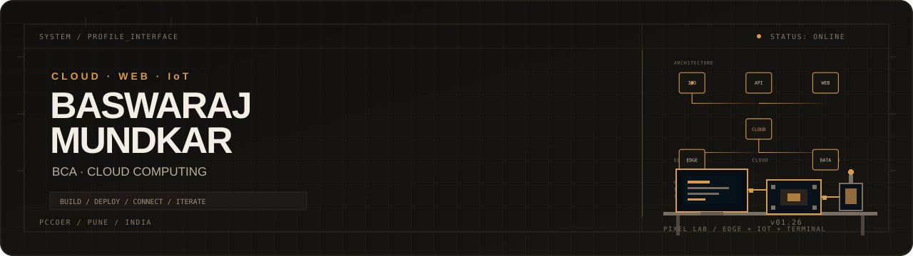

## About

BCA student specializing in **Cloud Computing** at PCCOER, Pune.

I build practical projects across **cloud, web development and IoT**, with a focus on learning by building, deploying and iterating.

**Currently exploring:** Cloud • DevOps • Python • Web Development • IoT

## Tech Stack

## GitHub

 

## Connect

&nbsp;

BUILD • LEARN • SHIP

