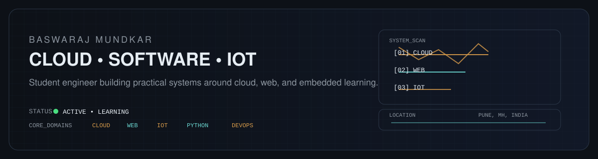

  <picture>
    <source media="(prefers-color-scheme: dark)" srcset="assets/hero-dark.svg">
    <source media="(prefers-color-scheme: light)" srcset="assets/hero-light.svg">
    
  </picture>

## Profile

BCA student at PCCOER, Pune, focused on cloud computing, software development, and IoT. I learn by building systems that combine practical code, infrastructure thinking, and hardware experimentation.

- Location: Pune, Maharashtra, India
- Current focus: Cloud • Python • Web • IoT • DevOps
- Study path: BCA — Cloud Computing, PCCOER, Pune

## Core stack

Python • HTML • CSS • JavaScript • C • C++ • Java • SQL / MySQL • AWS • Azure • Firebase • Git • GitHub • Arduino / IoT

## Project archive

### 01 — DrishtiX
[GitHub repo](https://github.com/Baswaraj-Mundkar/DrishtiX)

Verified public repo description: “Social Media & Fake News Awareness Platform.” The repository README describes it as a platform for misinformation awareness, crowdsourced reporting, and verification workflows. Technologies evidenced in the public repo and README: HTML, CSS, JavaScript, Leaflet.

### 02 — Bhoomifi
[GitHub repo](https://github.com/Baswaraj-Mundkar/Bhoomifi)

Public repo exists, but the repository README is the default Next.js starter template and does not provide a product-specific description. The project is retained as a real public repo reference rather than a claimed product profile.

Verified repo evidence: TypeScript, Next.js, React

## Connect

  
  &nbsp;
  

  BUILD • LEARN • SHIP

